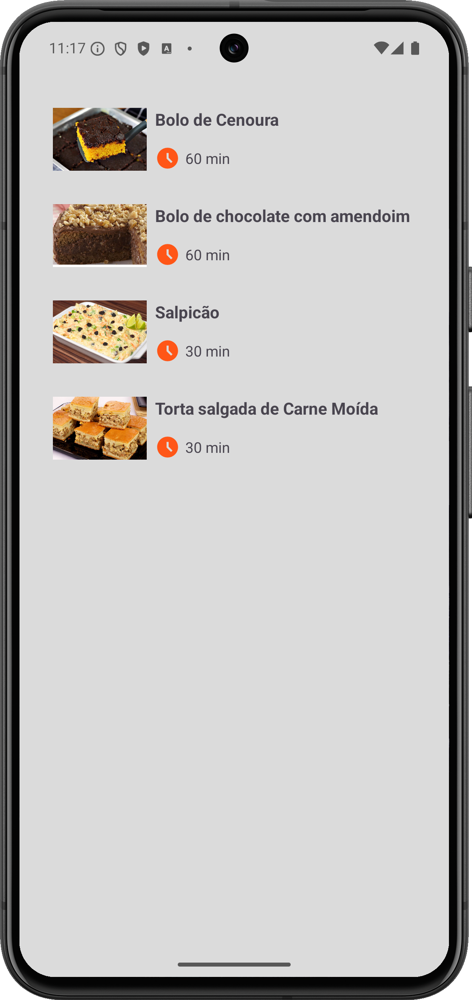
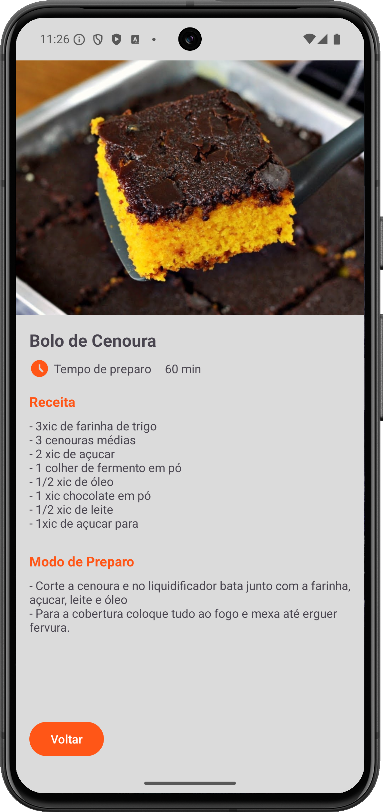

# App de Receitas 🍳

Projeto desenvolvido em **Kotlin** no Android Studio, que apresenta um app simples para exibir e detalhar receitas culinárias.
---

## 📚 **Conceitos Aplicados**

- **Kotlin**: Linguagem principal para o desenvolvimento do app.
- **RecyclerView**: Exibição de listas dinâmicas.
- **Padrão Adapter**: Implementado no `ReceitasAdapter` para conectar os dados (`Receita`) com a `RecyclerView`.
- **ViewHolder**: Utilizado para otimização de desempenho na lista.
- **Explicit Intent**: Navegação entre `Activity` usando `Intent`.
- **Transferência de dados**: Uso do `Intent.putExtra()` para enviar informações entre `Activity`.
- **Layouts em XML**: Definição e organização das telas.
- **Parcelable**: Passagem de objetos complexos entre `Activity` de forma eficiente.
- **Compatibilidade**: Uso de `Build.VERSION.SDK_INT` e `Build.VERSION_CODES.TIRAMISU` para compatibilidade com o método `getParcelable`.
- **Segurança contra NullPointerException**: Uso do operador `?.let` para manipulação segura de objetos nulos.
- **SOLID - Single Responsibility Principle**:
    - **MainActivity**: Configuração da lista de receitas e inicialização do `Adapter`.
    - **DetalhesActivity**: Exibição dos detalhes de uma receita.
    - **ReceitasAdapter**: Gerenciamento da lista e comportamento de clique.

---

## 📷 **Capturas de Tela**

### Tela Principal


### Tela de Detalhes


---

## 🚀 **Como Executar o Projeto**

1. Clone este repositório:
   ```bash
   git clone https://github.com/seu-usuario/seu-repositorio.git
   ```

2. Abra o projeto no **Android Studio** (versão Ladybug ou superior).

3. Execute o projeto em um emulador ou dispositivo físico com **API 21 (Lollipop)** ou superior.

---

## 🛠 **Tecnologias Utilizadas**

- **Kotlin**
- **Android Studio**
- **RecyclerView**
- **Intent / Parcelable**

---

## 🎯 **O que eu Aprendi**

Este projeto me proporcionou uma ótima experiência prática com:

- Criação e configuração de listas dinâmicas.
- Uso do padrão **Adapter** e **ViewHolder**.
- Navegação entre telas usando **Intent**.
- Transferência de dados complexos usando **Parcelable**.
- Aplicação de boas práticas, como o **Single Responsibility Principle**.

---
